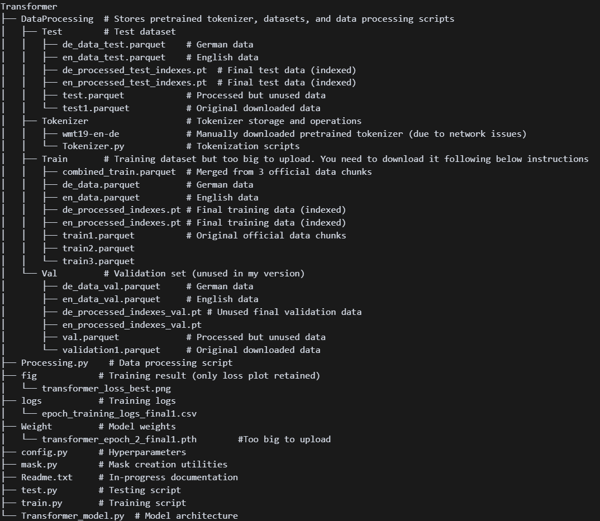

# Welcome to Transformer -Pytorch-implementation-tutorial!

This marks my first attempt to replicate a research paper as my introductory deep learning project. The journey was a rollercoaster ride – after excitedly completing the framework in just two days, I found myself submerged in countless iterations of data processing and training code. With the added challenge of school resuming, it took nearly a month of on-and-off work to finally bring the project to completion.
To help NLP beginners navigate this replication process with greater ease and accessibility, I've crafted this step-by-step tutorial. My hope is that it will serve as a guiding light, sparing you some of the pitfalls I encountered along the way.

## FileFrame

## Data Preparation Notes!!
- For the reason that the Train dataset are too big to upload, you needs to manual download!
- The large train files (from [WMT14 de-en dataset](https://huggingface.co/datasets/wmt/wmt14/viewer/de-en)) need manual download  
- Place the 3 train chunks in a new `Train` folder  
- Run `Processing.py` → `Tokenizer.py` to generate indexed training data

## Training Results

- Official BLEU: 27.4（Base Model）  
- My result: 28.77 (single GPU, batch_size=64, 2 epochs, 6h training)
- Beyond SOTA with less training cost(The reason will be explained later)

## Project Design Philosophy

- Simplified structure for beginners: Unlike many "production-ready" repos, this avoids excessive abstraction  
- Code fully annotated (with AI help!) to lower learning barriers  
- Every component explained clearly, ideal for understanding end-to-end NLP pipeline
## Differences from original paper Attention Is All You Need

- The components that I didn't finish are LabelSmoothing, Beamsearch.
- The changes I made from the paper: I tried to completely reproduce every detail of the paper and construct every part of it, 
but finally found the results were bad and computationally expensive. Inspired by my teammate Sen Chen, I deleted some classes like Embedding (which needed to multiply sqrt(dk) after nn.Embedding) and switched to the original Pytorch framework (like nn.Embedding and others).
- What surprised me is that with these changes, my model could quickly converge at a low level within only 2 epochs (better than 10 epochs before). 
Now I'm unsure whether omitting the sqrt(dk) scaling factor is theoretically better, or if this indicates a fundamental flaw in my programming project. 
I'm waiting for you to find out the answer.
## Reason why beyond sota

- One proper reason is that I used a better tokenizer (wmt19-en-de), which may help the model better understand sentences.
- Another possible reason is waiting for your exploration.

## Original aspiration

- This project documents my rookie journey – from initial excitement to iterative debugging. Hoping this transparent structure helps other beginners learn!

# Appendix
- Record some mistakes I made during the experience
<figure>
  
  <figcaption>Forget shuffle when training</figcaption>
</figure>
<figure>
  
  <figcaption>Forget ignore pad_idx when training</figcaption>
</figure>
<figure>
  
  <figcaption>ignore the wrong pad_idx when training</figcaption>
</figure>
